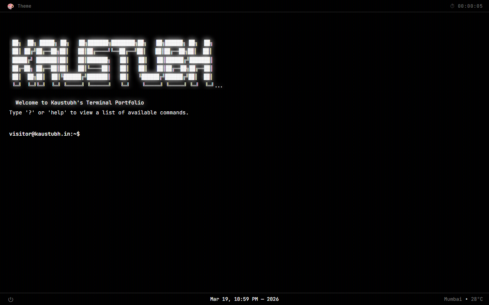
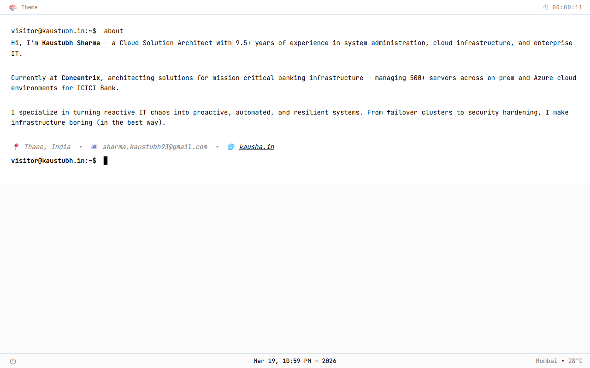
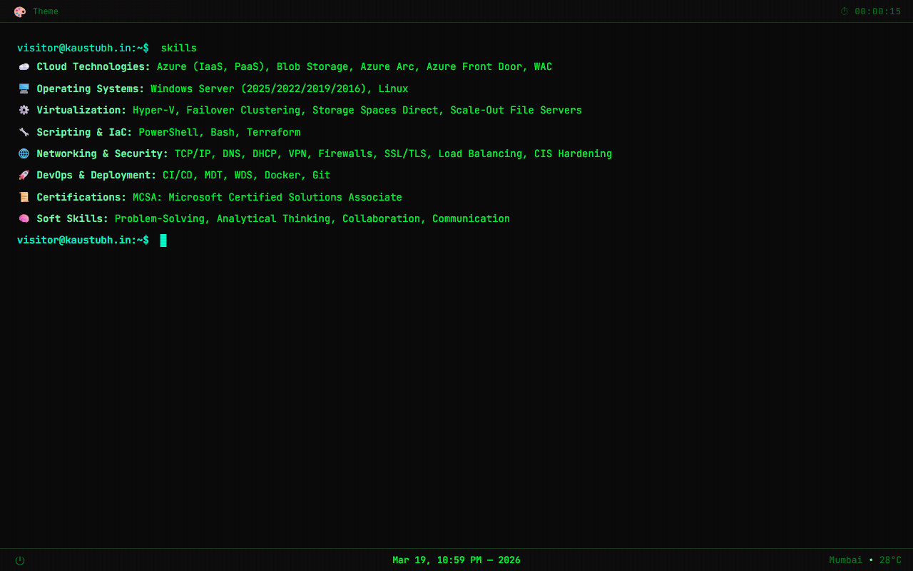
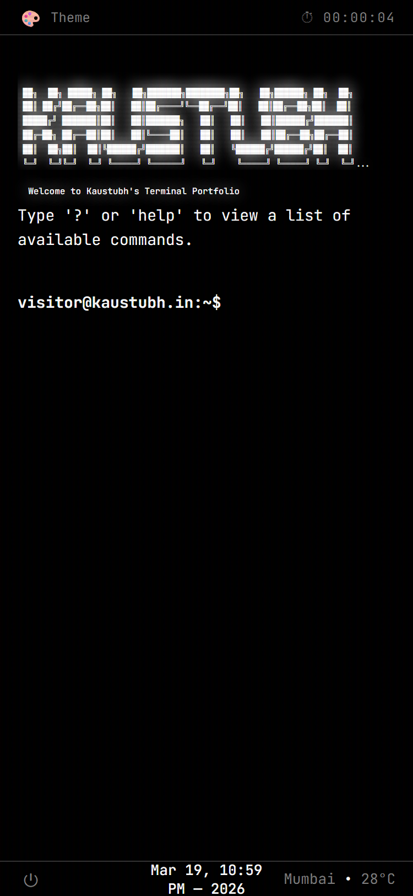

# 💻 Kaustubh Terminal Portfolio

**An interactive terminal-style portfolio where every command tells my story.**

### **[▶ Try the Live Demo](https://kaustubh-terminal.vercel.app)**

     

---

## 🎬 Demo


---

## ✨ Features

- **50+ commands** — portfolio, games, utilities, network tools, and more
- **3 themes** — Dark, Light, and Hacker (matrix green with glow effects)
- **Smart input** — auto-suggestions, tab completion, command history (↑/↓)
- **Matrix rain** — toggleable green rain overlay animation
- **Hacker mode** — 9-pane Hollywood-style hacking scene
- **Live widgets** — weather (auto-location), session uptime, calendar
- **Shutdown sim** — Linux-style boot sequence with sound effects
- **PWA-ready** — installable, responsive, CRT scanline effect
- **Mobile-friendly** — on-screen keyboard support for touch devices
- **Accessible** — ARIA roles, reduced motion support, noscript fallback
- **Security hardened** — CSP, X-Frame-Options, and more via `vercel.json`
- **Zero dependencies** — no npm, no build step, just open `index.html`

---

## 🎨 Themes

Switch with the `theme` command or click the 🎨 button in the header.

<table>
<tr>
<td align="center"><strong>🌑 Dark</strong></td>
<td align="center"><strong>☀️ Light</strong></td>
<td align="center"><strong>🟢 Hacker</strong></td>
</tr>
<tr>
<td></td>
<td></td>
<td></td>
</tr>
</table>

---

## 📱 Mobile View

Works on mobile too — tap the terminal area to bring up the keyboard.

<p align="center">
  
</p>

---

## 🛠️ Tech Stack

| Layer | Tech |
|-------|------|
| **Frontend** | HTML5, CSS3, JavaScript (ES6+) |
| **Font** | JetBrains Mono |
| **APIs** | Open-Meteo · Quotable · GEO IP · GitHub |
| **Hosting** | Vercel + Web Analytics |
| **Security** | CSP · HSTS · X-Frame-Options · Referrer-Policy |

---

## ⌨️ Key Commands

| Category | Examples |
|----------|----------|
| **Portfolio** | `about` · `skills` · `projects` · `social` · `contact` |
| **Themes** | `theme` · `set theme hacker` |
| **Utilities** | `weather` · `calendar` · `timer` · `stopwatch` · `remind` · `uuid` |
| **Text** | `echo` · `uppercase` · `reverse` · `base64` · `hash` |
| **Network** | `ip` · `geo` · `dns` · `ping` · `curl` · `github` |
| **Fun** | `matrix` · `hacker` · `coin` · `dice` · `rps` · `ttt` · `ascii` |
| **System** | `whoami` · `sysinfo` · `history` · `clear` · `shutdown` |

> Type `help` for the full list.

---

## 🚀 Getting Started

```bash
git clone https://github.com/kaustubh93-dev/kaustubh-terminal.git
cd kaustubh-terminal
```

Open `index.html` in your browser — that's it. No install, no build.

**Deploy to Vercel:** push to GitHub → import at [vercel.com](https://vercel.com) → done.

---

## 📁 Project Structure

```
kaustubh-terminal/
├── index.html            # Terminal layout and shell
├── vercel.json           # Security headers (CSP, X-Frame-Options, etc.)
├── assets/
│   ├── css/styles.css    # Themes, animations, responsive layout
│   ├── images/readme/    # Screenshots and demo GIF for this README
│   └── js/
│       ├── app.js        # Core logic — all 50+ command handlers
│       └── constants.js  # Personal config — bio, skills, projects, socials
├── robots.txt
├── site.webmanifest      # PWA manifest
└── README.md
```

---

## 🔧 Customization

Edit **`assets/js/constants.js`** to make it yours:

```javascript
window.TERM = {
    site: { domain: "you.dev", owner: "Your Name", email: "you@example.com" },
    aboutText: [...],      // Your bio
    skillsText: [...],     // Your skills
    projectsText: [...],   // Your projects
};
```

---

## 🔒 Security

This site ships with hardened HTTP security headers via `vercel.json`:

| Header | Value |
|--------|-------|
| `Content-Security-Policy` | Restricts scripts, styles, fonts, images, and connections to trusted sources |
| `X-Content-Type-Options` | `nosniff` |
| `X-Frame-Options` | `DENY` — prevents clickjacking |
| `Strict-Transport-Security` | HTTPS enforced with preload |
| `Referrer-Policy` | `strict-origin-when-cross-origin` |
| `Permissions-Policy` | Camera, microphone, and geolocation disabled |

---

## 🆕 Recent Improvements

**🔴 Security**
- Added 6 HTTP security headers (CSP, X-Frame-Options, X-Content-Type-Options, Referrer-Policy, Permissions-Policy, X-XSS-Protection)
- Fixed `target="_blank"` links to include `rel="noopener noreferrer"` — prevents tab-napping

**🟠 Bug Fixes**
- Removed duplicate Vercel analytics scripts (was double-counting page views)
- Added missing `<meta name="description">` for SEO
- Added favicon `<link>` tags for proper browser tab icons
- Fixed `robots.txt` sitemap pointing to wrong domain
- Removed dead code in `curl` command

**🟡 Accessibility**
- Added `prefers-reduced-motion` CSS — disables CRT flicker for users with vestibular disorders
- Added `<noscript>` fallback for users with JavaScript disabled
- Added ARIA roles (`role="log"`, `role="application"`) for screen readers

**🔵 UX**
- Added mobile keyboard support — tap the terminal to bring up the on-screen keyboard
- Replaced deprecated `navigator.platform` API with modern alternative

---

## 📄 License

MIT — fork it, customize it, make it yours.

---

<p align="center">
  Built with ☕ and <code>console.log()</code> by <a href="https://www.linkedin.com/in/kaustubh-sharma993/">Kaustubh Sharma</a>
</p>
